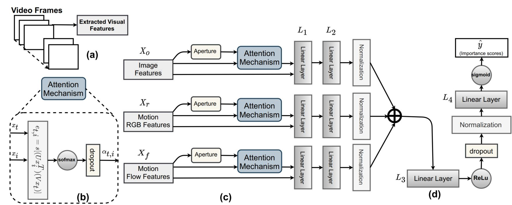

[](https://paperswithcode.com/sota/supervised-video-summarization-on-summe?p=supervised-video-summarization-via-multiple)

This is the official GitHub page for the paper:

> Junaid Ahmed Ghauri, Sherzod Hakimov, and Ralph Ewerth:
"Supervised Video Summarization via Multiple Feature Sets with Parallel Attention".
In: *In the Proceedings of IEEE International Conference on Multimedia and Expo (ICME) 2021.

The paper is available on:
- *arXiv*: https://arxiv.org/pdf/2104.11530.pdf


# MSVA (Multi Source Visual Attention)
MSVA is a deep learning model for supervised video summarization. In this research, we address this research gap and investigate how different feature types, i.e., static and motion features, can be integrated in a model architecture for video summarization.



## Get started (Requirements and Setup)
Python version >= 3.6

``` bash
# clone the repository
git clone git@github.com:VideoAnalysis/MSVA.git
cd MSVA
conda create -n msva python=3.6
conda activate msva  
pip install -r requirements.txt
```

## Dataset
Extracted features for the datasets can be downloaded as,
``` bash
wget -O datasets.tar https://zenodo.org/record/4682137/files/msva_video_summarization.tar
tar -xvf datasets.tar
```

### Dataset Files Structure

Dataset directory details to unerstand files heirarchies:
```
/datasets
   /kinetic_features	(features extracted using pretrained I3D model)	
      /summe
         /FLOW
            /features
               /*.npy   (files containing extracted features)
         /RGB
            /features
               /*.npy
         /targets	(labels synchronized with /object_features labels)
               /*.npy  
      /tvsum
         /FLOW
            /features
               /*.npy 
         /RGB
            /features
               /*.npy 
         /targets
               /*.npy
   /object_features
      /eccv16_dataset_summe_google_pool5.h5
      /eccv16_dataset_tvsum_google_pool5.h5
      /readme.txt

h5 files structure (object_features)
/key
    /features                 2D-array with shape (n_steps, feature-dimension)
    /gtscore                  1D-array with shape (n_steps), stores ground truth improtance score (used for training, e.g. regression loss)
    /user_summary             2D-array with shape (num_users, n_frames), each row is a binary vector (used for test)
    /change_points            2D-array with shape (num_segments, 2), each row stores indices of a segment
    /n_frame_per_seg          1D-array with shape (num_segments), indicates number of frames in each segment
    /n_frames                 number of frames in original video
    /picks                    posotions of subsampled frames in original video
    /n_steps                  number of subsampled frames
    /gtsummary                1D-array with shape (n_steps), ground truth summary provided by user (used for training, e.g. maximum likelihood)
    /video_name (optional)    original video name, only available for SumMe dataset	
	
```

## Training and Crossfold Validation
``` bash
# for training, crossfold validation according to default parameters "parameters.json".
python train.py -params parameters.json
```
## Inference with extracted features for summary scores
``` bash
python inference.py -dataset "summe" -video_name "Air_Force_One" -model_weight "model_weights/summe_random_non_overlap_0.5359.tar.pth"
```


## Experimental Configuration
Update parameters.json for desired experimental parameters.s.
``` bash
{"verbose":False,
"train":True,
"use_cuda":True,
"cuda_device":0,
"max_summary_length":0.15,
"weight_decay":0.00001,
"lr":[0.00005],
"epochs_max":300,
"train_batch_size":5,
"fusion_technique":'inter',
"method":'mean',
"sample_technique":'sub',
"stack":'v',
"name_anchor":"inter_add_aperture_250",
"output_dir" : "./results/",
"apertures":[250],
"combis":[[1,1,1]],
"feat_input":[1024],
"object_features":['datasets/object_features/eccv16_dataset_summe_google_pool5.h5',
			   'datasets/object_features/eccv16_dataset_tvsum_google_pool5.h5'],
"kinetic_features":"./datasets/kinetic_features/",
"splits":['splits/tvsum_splits.json',
 'splits/summe_splits.json',
 'splits/summe_random_non_overlap_splits.json',
 'splits/tvsum_random_non_overlap_splits.json'],
"feat_input":{"feature_size":365,"L1_out":365,"L2_out":365,"L3_out":512,"pred_out":1,"apperture":250,"dropout1":0.5,"att_dropout1":0.5,"feature_size_1_3":1024,"feature_size_4":365}}
```

## Other Options for Configuration Parameters
``` bash
"verbose" // True or False : if you want to see detailed running logs or not
"use_cuda" // True or False : if code should execute with GPU or CPU
"cuda_device" // 0, GPU index which will be running the deeplearning code.
"max_summary_length" //  0.15 is the summary length default set in experiments in early work for bench mark dataset
"weight_decay" //  0.00001 weight decay in torch adam optimizer 
"lr" // [0.00005] as learning rate during optimization 
"epochs_max" // maximum number of epochs in training
"train_batch_size"// 5, the trainign batch size, you can vary this to experiment with. 
"fusion_technique" // fusion technique cabe be 'early', 'inter' or 'late'
"method" //  this method reffers to early fusion operation. It can be 'min' for minimum, 'max' for maximum or 'mean' to take average of all. 
"sample_technique" // this can be 'sub' for sub sample or 'up' for up sample as interpolation when features are not matching the shape
"stack" // in early fusion you want 'v' for vertical stack or 'h' for horizontal stack of features of all sources 
"name_anchor" // this is just a name you want to add in to the models name and result files saved during train or test like "inter_add_aperture_250"
"output_dir" // output directory where you want to save the results like "./results/"
"apertures" // aperture size you want to experiment with like [250] but it can be a list you want to treat as hyperparameter optimization like [50, 100, 150, 200, 250, 300, 350, 400]
"combis" // combination of features you want to experiment with for example [[1,1,1]] means all three sources but it can be list of combination to see different combination roles like [[1,0,0],[1,1,1],[1,0,1],[1,1,0],[0,1,1],[0,1,0],[0,0,1]]
```

## Citation
```
@article{ghauri2021MSVA, 
   title={SUPERVISED VIDEO SUMMARIZATION VIA MULTIPLE FEATURE SETS WITH PARALLEL ATTENTION},
   author={Ghauri, Junaid Ahmed and Hakimov, Sherzod and Ewerth, Ralph}, 
   Conference={IEEE International Conference on Multimedia and Expo (ICME)}, 
   year={2021} 
}
```

For orignal source of these datasets including videos, Follow:
“[SumMe, Creating Summaries from User Videos, ECCV 2014](https://gyglim.github.io/me/vsum/index.html)”
“[TVSum , TVSum: Summarizing web videos using titles, 2015](https://github.com/yalesong/tvsum)”
